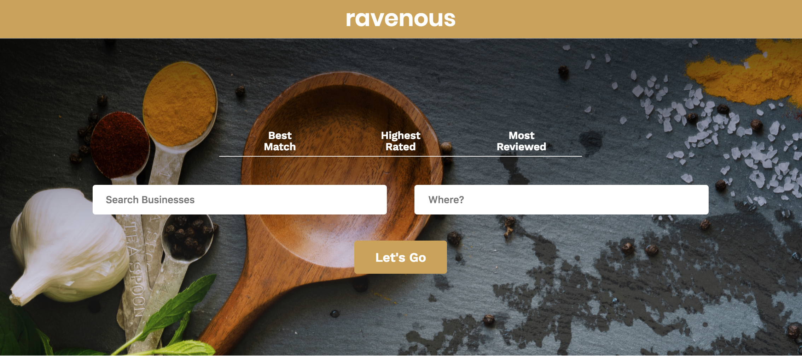

# About 
This is a React App where users can search for food. This is inspired by the Yelp app. 

# Motivations 
Building this app allowed me to express a couple of my favorite things: Technology and food. This was inspired by the Yelp app, which I think is a pretty cool app that allows users to write reviews of businesses, and help other users connect with businesses. I think it's kind of zen, actually. 

# Installation 
To enjoy the project, clone the repo and run `npm install` followed by `npm start`

# Future Directions 
* deploy the app remotely to Heroku 
* Create a React Native version of the application 
* Recommendations with location and open now filtering 

# Authors 

Noreen M 